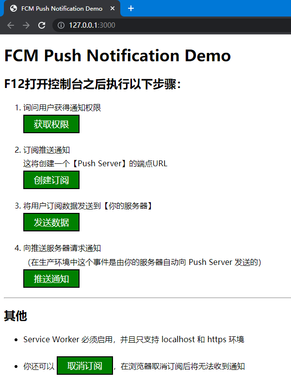

# FCM Push Notification Demo



## 步骤

```sh
# 后端
cd backend
yarn
node index.js

# 前端
cd frontend
yarn
yarn dev
```

## 参考

- [Engage your web app's users with push notifications  |  Google Developers](https://developers.google.com/learn/pathways/pwa-push-notifications)
- [Firebase 云消息传递  |  Firebase Cloud Messaging (google.com)](https://firebase.google.com/docs/cloud-messaging/?authuser=0#implementation_paths)
- [Spyna/push-notification-demo: How to implement Web Push Notifications with live demo and instructions (github.com)](https://github.com/Spyna/push-notification-demo)
